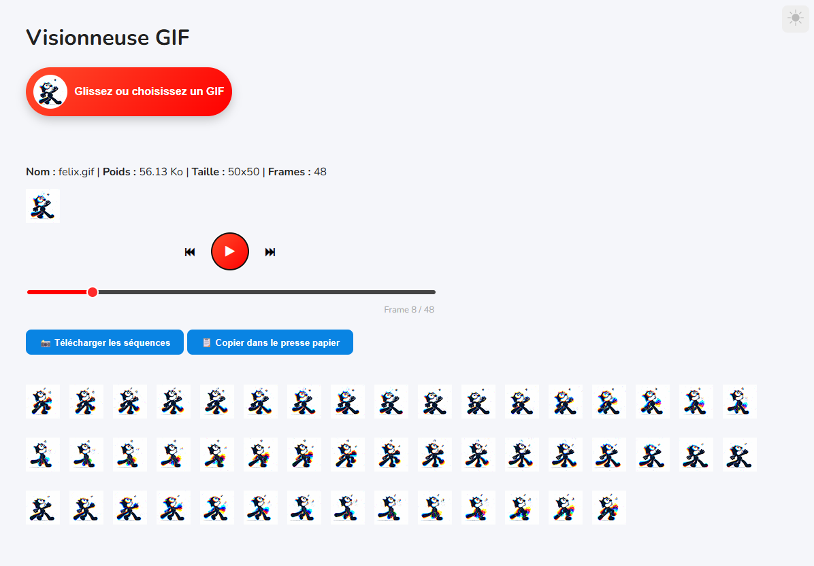

# 🎞️ Visionneuse GIF

Une application web simple permettant d'afficher un GIF dynamiques.

------------------------------------------------------------------------

## 🚀 Fonctionnalités

-   🔍 Donner des informations sur le GIF
-   🎞️ Affichage dynamique des animations
-   ⚡ Interface rapide et simple
-   📱 Compatible mobile et desktop
-   🌙 Darkmode
-   🔌❌ Aucune connexion réseau requise

------------------------------------------------------------------------

## 🛠️ Technologies utilisées

-   HTML5
-   CSS3
-   JavaScript
-   LottieFiles pour l'icône darkmode 🌙 (https://lottiefiles.com/)

------------------------------------------------------------------------

## 📂 Structure du projet

```
Visionneuse-GIF/
│── index.html              # Page principale
│── README.md               # Documentation du projet
│
└── assets/
    ├── css/
    │   └── style.css
    │
    ├── js/
    │   └── app.js
    │   └── lottie.min.js
    │   └── myIcon.js
    │
    ├── img/
    │   └── felix.gif
    │
    └── icons/
        └── icons8-sun.json
```

------------------------------------------------------------------------

## ⚙️ Installation

1.  Clone le projet :

git clone https://github.com/Mikael-david/Visionneuse-GIF.git

2.  Ouvre le fichier :

index.html

------------------------------------------------------------------------

## ▶️ Utilisation

-   Ouvre le site dans ton navigateur
-   Recherche ou glisse un GIF
-   Visualise les résultats instantanément

------------------------------------------------------------------------

## 📸 Aperçu



------------------------------------------------------------------------

## 🤝 Contribution

Les contributions sont les bienvenues !

------------------------------------------------------------------------

## 📄 Licence

Code libre d'utilisation.

Felix The Cat GIF by Tomas Brunsdon

https://dribbble.com/TomasBrunsdon

------------------------------------------------------------------------

## 👤 Auteur

-   Mikael David
-   GitHub : https://github.com/Mikael-david
